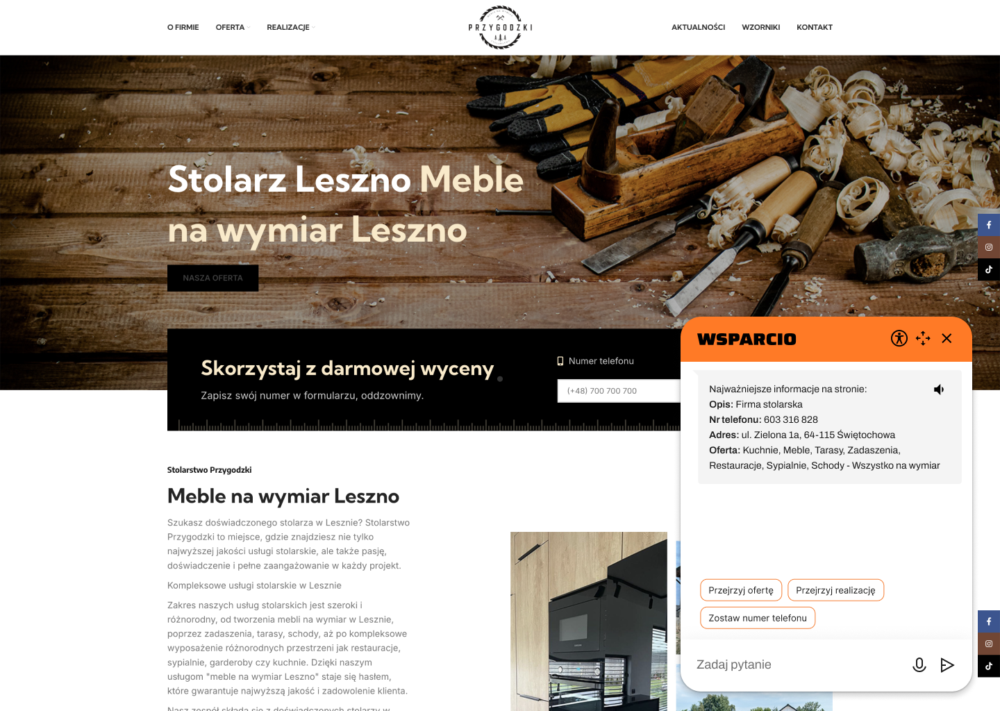

# Widok po wejściu na stronę: https://stolarstwoprzygodzki.pl/



## Widok po wybraniu oopcji "Przejrzyj ofertę".

<Opis widoku>

(agent otwiera stronę: https://stolarstwoprzygodzki.pl/oferta-stolarz-leszno/)

Chat pyta, którą część oferty user chce przejrzeć. Listuje
```sh
Zadaszenia, Tarasy, Schody, Restauracje, Sypialnie, Garderoby, Meble, Kuchnie.
```
/<Opis widoku>
## Interakcja z czatem, rozmowa z nim o opcji
<Opis widoku>
User nie chce tego, pyta się co oznacza wcześniej zaproponowana opcja "Zostaw numer telefonu".

Agent odpowiada, że można w ten sposób skorzystać z darmowej wyceny. Firma stolarska oddzwoni na pozostawiony w formularzu numer telefonu.
</Opis widoku>

## Wejście na strone Hackyeah.

https://hackyeah.pl/ 
<Opis widoku>
W czacie niech będzie:

Info:
- Opis: Największy stacjonarny hackaton w Europie. Wydarzenie odbywa sie w Polsce. W tym roku w dniach 28-29 września.
- Lokalizacja: Tauron Arena Kraków.
- Organizatorzy: firma PROIDEA i partnerzy
- Wydarzenie: zespoły informatyków mają 24 godziny na wykonanie zadań programistycznych

Akcje do wykonania na stronie:
- Rejestracja
- Przegląd zadań 
- Przegląd sponsorów i partnerów
</Opis widoku>

## Kliknięcie opcji "ludzika"
Na stronie Hackyeah, zrobienie takiego dużego czatu itp. (Linh wie xd)

## Duży prompt na OLX, żeby zmienić hasło


