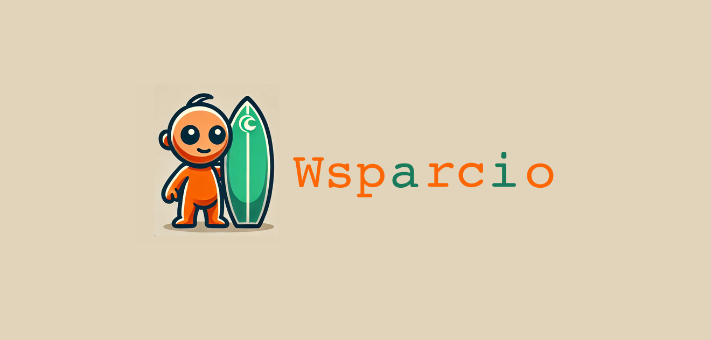
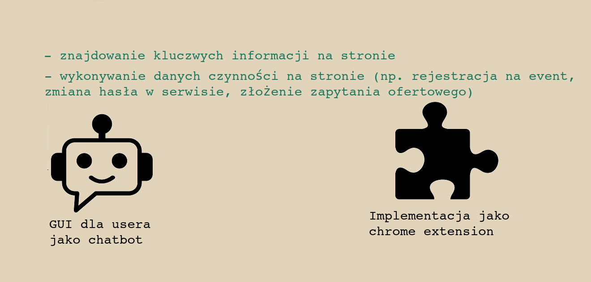
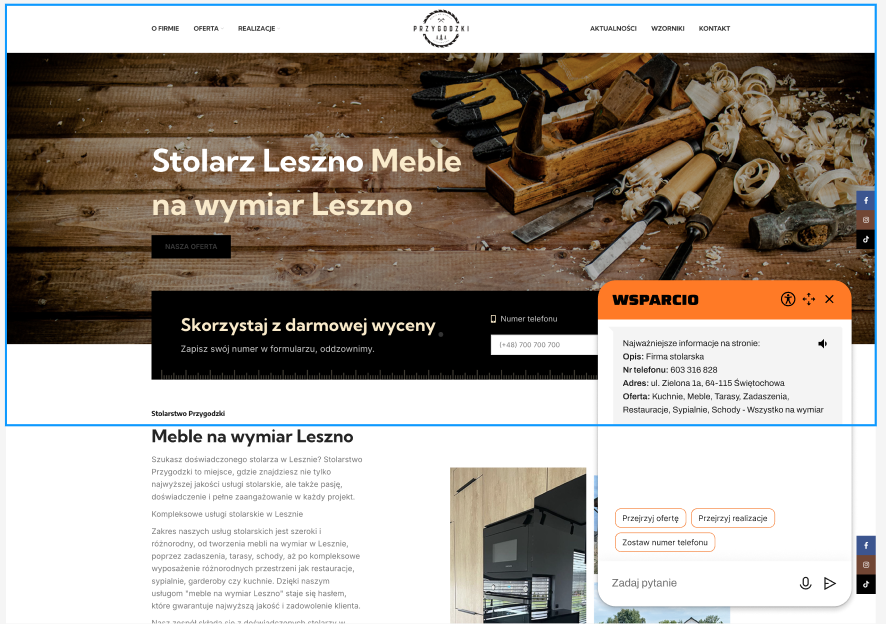
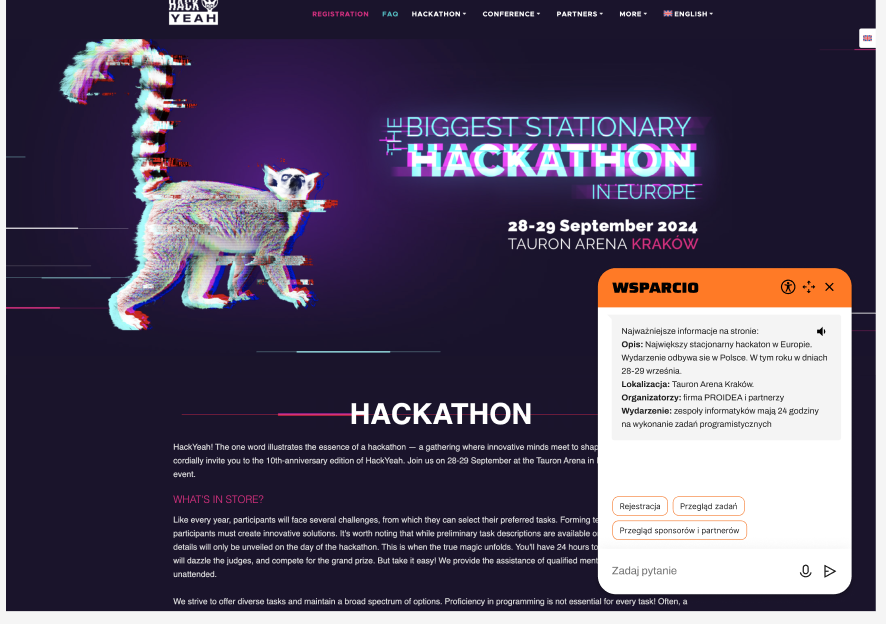
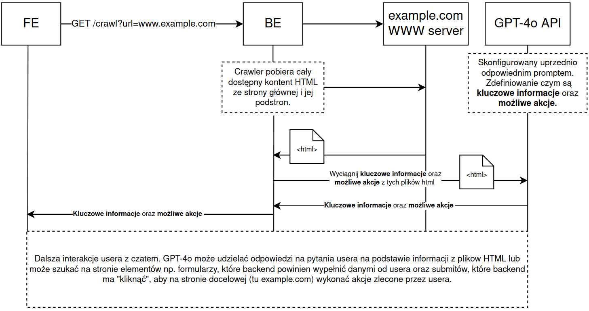
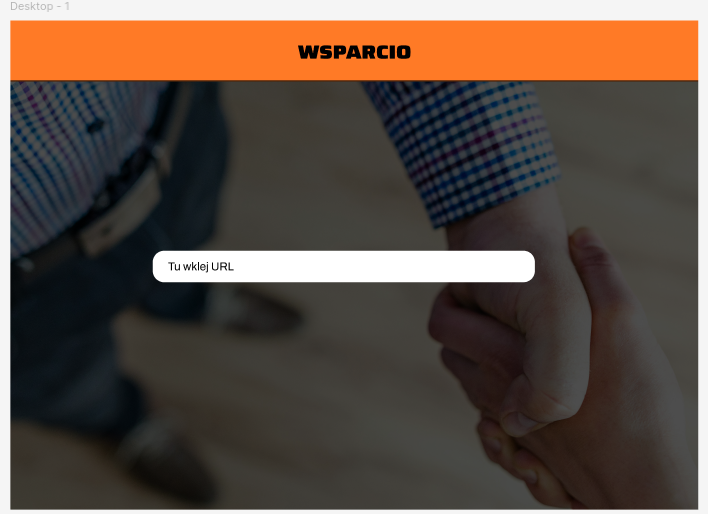
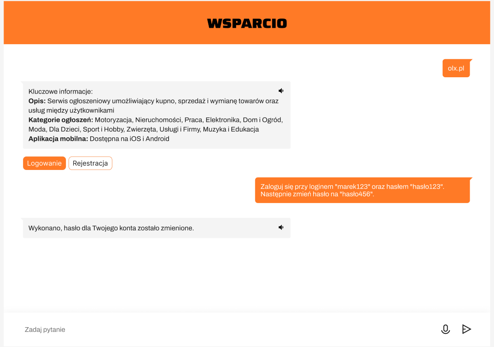

# Slajd 1 - powitanie

Duży napis wsparcio z logiem po lewej np.

# Slajd 2- Opis fast

Agent AI, przystosowany do surfowania po sieci!

Na slajdzie:

- Znajdowanie kluczowych informacji na stronie
- wykonywanie danych czynności na stronie (np. rejestracja na event, zmiana hasła w serwisie, złożenie zapytania ofertowego)

na dole chatbot icon jako UI dla użytkownika z labelem: "GUI dla usera w formie chatbot'u"

obok po prawej chrome extension icon "Implemtnacja jako chrome extension".

# Slajd 3 - Makieta - showcase

# Slajd 4 - Druga makieta showcase

 

# Slajd 5 - How it works behind?

 

# Slajd 6 - Landing page agenta

Oferujemy też po prostu swoje API, nie tylko jako wtyczka chrome.

 

# Slajd 7 - Landing page agenta 2

# Slajd 8

Duży napis MVP

# Slajd 9

Podczas hackatonu udało nam się przygotować:

- mockupy w figmie -> link do figmy
- 

# Slajd 10

Powtórka pierwszego

